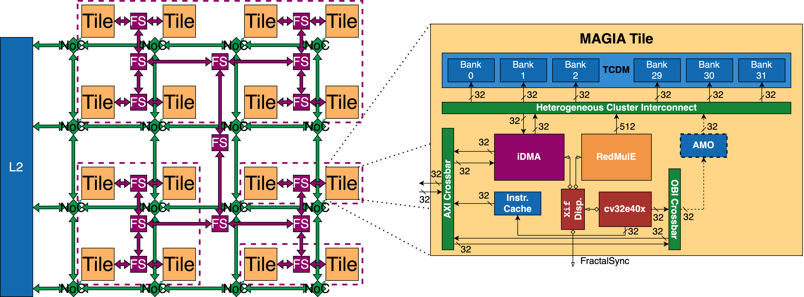

# MAGIA
[](LICENSE.APACHE)
[](LICENSE.SHL)

This repo contains MAGIA (**M**esh **A**rchitecture for **G**enerative **I**ntelligence **A**cceleration), an open-source large-scale accelerator designed for Generative Artificial Intelligence (GenAI). MAGIA is a network of tiles that have at their heart [RedMulE](https://github.com/pulp-platform/redmule) for General Matrix Multiply (GeMM) acceleration, [iDMA](https://github.com/pulp-platform/iDMA) for fast and efficient data movement and an L1 scratchpad memory (SPM). Tiles are connected to a mesh Network-on-Chip (NoC) - [FlooNoC](https://github.com/pulp-platform/FlooNoC) - used for communication, and a dedicated network for synchronization - [FractalSync](https://github.com/VictorIsachi/fractal_sync). MAGIA is designed to support matrices of sizes that vary by orders of magnitude, and also sparse matrix multiplication. 

MAGIA is developed as part of the [PULP (Parallel Ultra-Low Power)](https://pulp-platform.org/) project, a joint effort between ETH Zurich and the University of Bologna.

## ⭐ Getting Started

### Pre-requisites

MAGIA uses [bender](https://github.com/pulp-platform/bender) to manage its dependencies and to automatically generate compilation scripts.

### Simulation

The following *optional* parameters can be specified:

`mesh_dv`: **0**|**1** (**Default**: 1). 0 simulation of a single tile; 1 simulation of the entire mesh.

`fast_sim`: **0**|**1** (**Default**: 0). 0 faster simulation that does not track signals; 1 simulation that tracks signals (for debugging).

`gui`: **0**|**1** (**Default**: 0). 0 simulation without GUI; 1 simulation with GUI.

`test`: **tile_test**|**mesh_test** (**Default**: mesh_test). Specifies which tests should be run. More fine-grain tests are available, see `sw/tests`.

**Instructions to build HW/SW and run simulations**:

**1)** Setup the *environment* (`magia` folder):
```bash
source setup_env.sh
```
**2)** Download *Bender* (`magia` folder):
```bash
make bender
```
**3)** Clone the *dependencies* and generate the *compilation script* (`magia` folder):
```bash
make update-ips > update-ips.log <mesh_dv>
```
**3\*)** Apply FlooNoC *patch* - **currently FlooNoC requires this step but should not need it in the future** (`magia` folder):
```bash
make floonoc-patch
```
**4)** *Build* the hardware (`magia` folder):
```bash
make build-hw > build-hw.log <mesh_dv> <fast_sim>
```
**5)** *Compile* the test code (`magia` folder):
```bash
make all <test>
```
**6)** *Run* test (`magia` folder):
```bash
make run <test> <gui> <mesh_dv>
```

**Full example**:
```bash
source setup_env.sh
make bender
make update-ips > update-ips.log
make build-hw > build-hw.log fast_sim=1
make all test=fsync_test
make run test=fsync_test
```

## ⚙️ Architecture



### Tile
The central piece of the architecture is the MAGIA tile containing a GeMM accelerator, a DMA engine, a multi-banked L1 SPM and a lightweight control core. The L1 features interleaved memory banks that compose the Tightly-Coupled Data Memory (TCDM). Each tile has access to the global L2 and to a subset of other tiles’ L1, accessing the latter via remote direct memory access (RDMA). Inter-tile and global communication is carried out through a 2-channel 32-bit [AXI4](https://github.com/pulp-platform/axi) crossbar (XBAR). External tiles and the core access the L1 through an OpenBus Interface ([OBI](https://github.com/pulp-platform/obi)) XBAR and an atomic memory operation (AMO) hardware module.

Each tile is controlled by a [CV32E40X](https://github.com/pulp-platform/cv32e40x). The system has been extended with custom instructions to program and control the iDMA, RedMulE, and FractalSync. These instructions are implemented using eXtension Interface (Xif). A dedicated module dispatches instructions not meant for the core to the appropriate module.

### Mesh
Replicating the MAGIA tile, we scale up to a homogeneous two-dimensional (2D) mesh of compute tiles. The NoC allows access to the global west-side L2 via a number of interfaces equal to the number of rows. The mesh features a 2D XY topology with 32-bit physical links. The conversion between the AXI4 protocol, used by the compute tiles, and the network-level protocol is performed by Network Interfaces (NIs) between each tile and the near router.

Rendez-vous among tiles are managed through the FractalSync (FS) mechanism and the dedicated H-tree network.

### Memory map
L1 size: 1 MB per tile (896kB Usable - 64kB Stack, 64kB Reserved (e.g. synchronization)).

L2 size: 1 GB.

| Region           | Range                                         | Notes                                                                      |
|------------------|-----------------------------------------------|----------------------------------------------------------------------------|
| *Reserved*       | \[0x0000_0000:0x0000_FFFF\]+*ID*\*0x0010_0000 | *ID* is the **mhartid** of the Tile                                        |
| *Stack*          | \[0x0001_0000:0x0001_FFFF\]                   | \[0x0001_0000:0x0001_FFFF\]+*ID*\*0x0010_0000, *ID* > 0, are **forbidden** |
| *L1*             | \[0x0002_0000:0x000F_FFFF\]+*ID*\*0x0010_0000 | Up to 3072 tiles                                                           |
| *L2*             | \[0xC000_0000:0xFFFF_FFFF\]                   |                                                                            |
| *Instructions*   | \[0xCC00_0000:0xCC00_8000\]                   |                                                                            |
| *Data*           | \[0xCC01_0000:0xCC04_0000\]                   |                                                                            |
| *L2 Base*        | 0xCC00_0000                                   |                                                                            |
| *Test End*       | 0xCC03_0000                                   |                                                                            |
| *String (utoa)*  | 0x0000_0000+*ID*\*0x0010_0000                 |                                                                            |
| *Print (stderr)* | 0xFFFF_0000                                   |                                                                            |
| *Print (stdio)*  | 0xFFFF_0004                                   |                                                                            |
| *Synch.*         | 0x0000_F000+*ID*\*0x0010_0000                 |                                                                            |

## 🖥️ Programming model
The systems supports the RV32IMA ISA and provies a set of **C functions** to program RedMulE, the iDMA and FractalSync.

### RedMulE instructions

Performing *Y = (X x W) + Y*, where Y, X and W are *M x K*, *M x N* and *N x K* matrices respectively, can be done with the following functions:

```c
/* Configure sizes of matrices.
 * k_size [uint16_t]: Number of columns of Y and W.
 * m_size [uint16_t]: Number of rows of Y and X.
 * n_size [uint16_t]: Number of columns of X and rows of W. 
 */  
redmule_mcnfig(k_size, m_size, n_size);

/* Provide locations of matrices and start matrix multiplication.
 * x_base [uint32_t]: Source address of X.
 * w_base [uint32_t]: Source address of W.
 * y_base [uint32_t]: Source address of W.
 */
redmule_marith(x_base, w_base, y_base);
```

### iDMA instructions

Data transfers can occur concurently with GeMM operations. Furthermore, trasfters from and to the L1 can overlap. To start a transfer you must first configurre the iDMA transfer channel, setup transfer parameters (e.g. source address, destination address, length, stride 2, etc.) and then indicate transfer request.

```c
/* Configure the iDMA for input (i.e. external to L1) data transfers.
 */  
idma_conf_in();

/* Configure the iDMA for output (i.e. L1 to external) data transfers.
 */
idma_conf_out();

/* Setup for input data transfers.
 * dst_addr [uint32_t]: Destination address of the input data transfer.
 * src_addr [uint32_t]: Source address of the input data trasfer.
 * len      [uint32_t]: Length of the input data transfer.
 */
idma_set_addr_len_in(dst_addr, src_addr, len);

/* Setup for output data transfers.
 * dst_addr [uint32_t]: Destination address of the output data transfer.
 * src_addr [uint32_t]: Source address of the output data trasfer.
 * len      [uint32_t]: Length of the output data transfer.
 */
idma_set_addr_len_out(dst_addr, src_addr, len);

/* Setup for input data transfers.
 * dst_std_2 [uint32_t]: Destination stride 2 of the input data transfer.
 * src_std_2 [uint32_t]: Source stride 2 of the input data trasfer.
 * reps_2    [uint32_t]: Repetitions 2 of the input data transfer.
 */
idma_set_std2_rep2_in(dst_std_2, src_std_2, reps_2);

/* Setup for output data transfers.
 * dst_std_2 [uint32_t]: Destination stride 2 of the output data transfer.
 * src_std_2 [uint32_t]: Source stride 2 of the output data trasfer.
 * reps_2    [uint32_t]: Repetitions 2 of the output data transfer.
 */
idma_set_std2_rep2_out(dst_std_2, src_std_2, reps_2);

/* Setup for input data transfers.
 * dst_std_3 [uint32_t]: Destination stride 3 of the input data transfer.
 * src_std_3 [uint32_t]: Source stride 3 of the input data trasfer.
 * reps_3    [uint32_t]: Repetitions 3 of the input data transfer.
 */
idma_set_std3_rep3_in(dst_std_3, src_std_3, reps_3);

/* Setup for output data transfers.
 * dst_std_3 [uint32_t]: Destination stride 3 of the output data transfer.
 * src_std_3 [uint32_t]: Source stride 3 of the output data trasfer.
 * reps_3    [uint32_t]: Repetitions 3 of the output data transfer.
 */
idma_set_std3_rep3_out(dst_std_3, src_std_3, reps_3);

/* Start input data transfer.
 */  
idma_start_in();

/* Start output data transfer.
 */
idma_start_out();
```

### FractalSync instructions

Synchronizing a synchronization domain (i.e. a set of tiles that have a common FractalSync node) can be done with the function below. Note that all synchronization nodes in a synchronization domain must request synchronization for it to occur.

```c
/* Request barrier synchronization.
 * level [uint32_t]: Level of the synchronization tree where synchronization ought to occur.
 */  
fsync(level);
```

## 🧰 Changing number of tiles
**Supported Mesh Configurations**: `2x2`, `4x4`, `8x8`, `16x16`, `32x32`

**Scripts**: The `num_cores` parameter in the `Makefile` specifies for how many core stack traces should be generated.

**Tests**  : The `MESH_X_TILES` and `MESH_Y_TILES` parameters in `sw/utils/magia_utils.h` adapt the software stack to the specific mesh configuration.

**RTL/TB** : The `N_TILES_X` and `N_TILES_Y` parameters in `hw/mesh/magia_pkg.sv` specifie the number of tiles and allows the derivation of the appropriate data and syncrhonization networks.

## 🔏 License
MAGIA is an open-source project with a permissive license. All `software` sources are licensed under the Apache License 2.0 ([`LICENSE.APACHE`](LICENSE.APACHE)). All `hardware` sources are licensed under the Solderpad Hardware License 0.51 ([`LICENSE.SHL`](LICENSE.SHL)).

