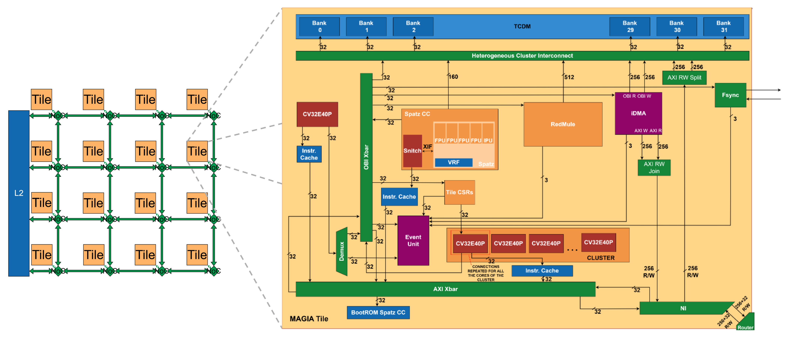

# MAGIA
[](LICENSE.APACHE)
[](LICENSE.SHL)

This repo contains MAGIA (**M**esh **A**rchitecture for **G**enerative **I**ntelligence **A**cceleration), an open-source large-scale accelerator designed for Generative Artificial Intelligence (GenAI). MAGIA is a network of tiles that have at their heart [RedMulE](https://github.com/pulp-platform/redmule) for General Matrix Multiply (GeMM) acceleration, [iDMA](https://github.com/pulp-platform/iDMA) for fast and efficient data movement, [Spatz Core Complex (Spatz CC)](https://github.com/pulp-platform/spatz) for vector workloads acceleration, a [PULP cluster](https://github.com/pulp-platform/cv32e40p) of 8 RISC-V cores for data-parallel workloads, and an L1 scratchpad memory (SPM). Tiles are connected to a mesh Network-on-Chip (NoC) - [FlooNoC](https://github.com/pulp-platform/FlooNoC) - used for communication, and a dedicated network for synchronization - [FractalSync](https://github.com/VictorIsachi/fractal_sync). Each tile is equipped with an [Event Unit](https://github.com/pulp-platform/event_unit_flex) for tile synchronization and event aggregation. MAGIA is designed to support matrices of sizes that vary by orders of magnitude, and also sparse matrix multiplication.

MAGIA is developed as part of the [PULP (Parallel Ultra-Low Power)](https://pulp-platform.org/) project, a joint effort between ETH Zurich and the University of Bologna.

## ⭐ Getting Started

### Pre-requisites

MAGIA uses [bender](https://github.com/pulp-platform/bender) to manage its dependencies and to automatically generate compilation scripts.

We use a virtual python environment which requires python>=3.6.8. To *create the envrionment* use (`MAGIA` folder):

```bash
make python_venv
```

By default, the `python` in your `$PATH` is used. You can specify the version by optionally exporting the `BASE_PYTHON` environment variable.

### Simulation

The following *optional* parameters can be specified:


`mesh_dv`: **0**|**1** (**Default**: 1). 0 simulation of a single tile; 1 simulation of the entire mesh.

`fast_sim`: **0**|**1** (**Default**: 0). 0 simulation that tracks signals (for debugging); 1 faster simulation that does not track signals.

`gui`: **0**|**1** (**Default**: 0). 0 simulation without GUI; 1 simulation with GUI.


**Instructions to build HW/SW and run simulations**:

**1)** Setup the *environment* (`MAGIA` folder):
```bash
source setup_env.sh
```
**2)** Install *python dependencies* (`MAGIA` folder):
```bash
make python_deps
```
**3)** Download *Bender* (`MAGIA` folder):
```bash
make bender
```
**4)** Clone the *dependencies* and generate the *compilation script* (`MAGIA` folder):
```bash
make update-ips > update-ips.log <mesh_dv>
```
**4\*)** Apply FlooNoC *patch* - **currently FlooNoC requires this step but should not need it in the future** (`MAGIA` folder):
```bash
make floonoc-patch
```
**5)** *Build* the hardware (`MAGIA` folder):
```bash
make build-hw > build-hw.log <mesh_dv> <fast_sim>
```
**6)** *Compile* the test code (`MAGIA` folder):
```bash
make all <test>
```
**7)** *Run* test (`MAGIA` folder):
```bash
make run <test> <gui> <mesh_dv>
```

**Full example**:
```bash
make python_venv
source setup_env.sh
make python_deps
make bender
make update-ips > update-ips.log 
make build-hw > build-hw.log fast_sim=1
make all test=fsync_test
make run test=fsync_test
```

## ⚙️ Architecture



### Tile
The central piece of the architecture is the MAGIA tile containing a GeMM accelerator, a Vector Processor, a DMA engine, a PULP cluster of 8 RISC-V cores, a multi-banked L1 SPM, an Event Unit, and a lightweight control core. The L1 features interleaved memory banks that compose the Tightly-Coupled Data Memory (TCDM). Each tile has access to the global L2 and to a subset of other tiles' L1, accessing the latter via on-chip remote direct memory access (RDMA). Inter-tile and global communication is carried out through AXI-based narrow (32-bit) and wide (256-bit) NoC channels in [FlooNoC](https://github.com/pulp-platform/FlooNoC). External tiles and the core access the L1 through an OpenBus Interface ([OBI](https://github.com/pulp-platform/obi)) XBAR.

Each tile is controlled by a [CV32E40P](https://github.com/pulp-platform/cv32e40p) main core. Control of iDMA, RedMulE, FractalSync, Spatz CC, and the PULP cluster follows a memory-mapped model, with the Event Unit handling event aggregation for system control.

#### PULP Cluster
Each tile embeds a cluster of 8 [CV32E40P](https://github.com/pulp-platform/cv32e40p) (or RI5CY) cores. Cluster cores share a Snitch instruction cache with an AXI refill path to L2, and each core has its own OBI master port into the tile crossbar for data accesses (L1, accelerator registers, PULP_CTRL). Cluster cores receive interrupts exclusively from the tile CSR (`PULP_CTRL`) — they are not connected to the Event Unit. The main core dispatches tasks to the cluster via the `PULP_CTRL` register block (`0x1740`), which provides: binary entry point (`PULP_BINARY`), per-core MEI dispatch (`PULP_START`), task function pointer (`PULP_TASKBIN`), data pointer (`PULP_DATA`), completion quorum (`PULP_NB_CORES_TO_WAIT`), and readiness/done handshake registers (`PULP_READY`, `PULP_DONE`). When the done quorum is reached, the tile CSR raises EU bit 12 on the main core's Event Unit, allowing the main core to sleep in WFE until the cluster finishes.

### Mesh
Replicating the MAGIA tile, we scale up to a homogeneous two-dimensional (2D) mesh of compute tiles. The NoC allows access to the global west-side L2 through row-side interfaces, while tiles exchange traffic through FlooNoC router. The mesh uses XY routing and carries both AXI narrow channels (32-bit) and AXI wide channels (256-bit), with protocol conversion handled by per-tile Network Interfaces (NIs).

Rendez-vous among tiles are managed through the FractalSync (FS) mechanism and the dedicated network.

### Memory map
This map reflects the RTL memory-mapped layout defined in `hw/tile/magia_tile_pkg.sv`.

- `tile_base = mhartid * 0x0010_0000`

Per-tile local map (offset from `tile_base`, starts at `0x0000_0000`):

| Region            | Local Range             | Global Range (`tile_base + offset`) |
|-------------------|-------------------------|--------------------------------------|
| *RedMulE CTRL*    | `0x0000_0100-0x0000_01FF` | `tile_base + 0x0000_0100 ... 0x0000_01FF` |
| *iDMA CTRL*       | `0x0000_0200-0x0000_05FF` | `tile_base + 0x0000_0200 ... 0x0000_05FF` |
| *FractalSync CTRL*| `0x0000_0600-0x0000_06FF` | `tile_base + 0x0000_0600 ... 0x0000_06FF` |
| *Event Unit*      | `0x0000_0700-0x0000_16FF` | `tile_base + 0x0000_0700 ... 0x0000_16FF` |
| *Spatz CTRL*      | `0x0000_1700-0x0000_173F` | `tile_base + 0x0000_1700 ... 0x0000_173F` |
| *PULP CTRL*       | `0x0000_1740-0x0000_17FF` | `tile_base + 0x0000_1740 ... 0x0000_17FF` |
| *Reserved*        | `0x0000_0000-0x0000_FFFF` | `tile_base + 0x0000_0000 ... 0x0000_FFFF` |
| *Stack*           | `0x0001_0000-0x0001_FFFF` | `tile_base + 0x0001_0000 ... 0x0001_FFFF` |
| *L1 SPM*          | `0x0002_0000-0x000F_FFFF` | `tile_base + 0x0002_0000 ... 0x000F_FFFF` |

Shared/global map:

| Region            | Range                   | Notes |
|-------------------|-------------------------|-------|
| *Spatz BootROM*   | `0x1000_0000-0x1000_00FF` | Tile AXI xbar bootrom target |
| *L2*              | `0xC000_0000-0xFFFF_FFFF` | Global L2 window |
| *Instructions*    | `0xCC00_0000-0xCC00_7FFF` | Instruction sub-region inside L2 |

Software/test utility addresses (used by SW runtime and testbench VIP):

| Region            | Address                                    | Notes |
|-------------------|--------------------------------------------|-------|
| *Test End*        | `0xCCFF_0000`                              | Exit code location used by SW runtime/tests |
| *String (utoa)*   | `tile_base + 0x0000_1800`                  | String scratch location (`RESERVED_START + STR_OFFSET`) |
| *Print (stderr)*  | `0xFFFF_0000`                              | Memory-mapped stderr sink in simulation VIP |
| *Print (stdio)*   | `0xFFFF_0004`                              | Memory-mapped stdio sink in simulation VIP |
| *Synch.*          | `tile_base + 0x0000_F000`                  | Derived from `RESERVED_START + SYNC_OFFSET` |

## 🖥️ Programming model
The flow is memory-mapped (MM): software configures and starts accelerators by writing control registers in each tile address space.

- Execution model: SPMD over tiles, with `mhartid` selecting `tile_base = mhartid * 0x0010_0000`.
- Control path: CV32E40P accesses RedMulE, iDMA, FractalSync, Event Unit, and Spatz control registers via MMIO.
- Data path: iDMA moves data between L1 and external memory, while compute engines consume/produce data in L1.
- Synchronization: Event Unit and FractalSync provide interrupt/event and barrier mechanisms for inter-tile coordination.

Software APIs for MM control are under `sw/utils/` (for example `redmule_mm_utils.h`, `idma_mm_utils.h`, `fsync_mm_api.h`, `magia_spatz_utils.h` and `event_unit_utils.h`).
For Spatz Core Complex programming flow (runtime handshake, task loading, and execution model), see [spatz/README.md](spatz/README.md).

### PULP Cluster programming flow
The PULP cluster uses a bare-metal dynamic dispatch model. The cluster binary is compiled as a position-independent ELF (origin `0x0`), converted to a flat binary, and embedded in the CV32 ELF as a byte array in the `.pulp_binary` section (see `sw/kernel_pulp/`).

**Dispatch flow** (`sw/utils/cluster_utils.h`, `sw/utils/magia_pulp_utils.h`):

1. `cluster_boot(binary_start)` — writes `PULP_BINARY`, asserts `CLK_EN`, polls `PULP_READY` until all 8 cores have armed their dispatcher loop.
2. `cluster_arm_done_event()` — clears the CV32 Event Unit buffer and enables only EU bit 12 (cluster-done), avoiding spurious wakeups from stale RedMulE/iDMA events.
3. `cluster_dispatch_task(task_addr, core_mask)` — writes `NB_CORES_TO_WAIT`, `TASKBIN`, then `PULP_START = core_mask`, which fires a per-core MEI to each selected core. Returns once all selected cores have ACK'd (i.e., `PULP_START` self-clears).
4. `cluster_wait_done_eu()` — CV32 sleeps in `cv.elw` until EU bit 12 fires (PULP_DONE quorum reached).
5. `cluster_stop()` — de-asserts `CLK_EN` to gate the cluster clock.

Each cluster core runs a dispatcher loop that waits in `WFI` for the MEI, reads `PULP_TASKBIN`/`PULP_DATA` from the trap handler, calls the task function, writes `PULP_DONE`, and re-enters `WFI`.

Cluster task sources live under `sw/tests/<test>/pulp_task/`. A test directory containing a `pulp_task/` subdirectory automatically triggers the dual-binary build flow in the Makefile.
## 🧰 Changing number of tiles
**Supported Mesh Configurations**: `2x2`, `4x4`, `8x8`, `16x16`, `32x32`

**Scripts**: The `num_cores` parameter in the `Makefile` specifies for how many core stack traces should be generated.

**Tests**  : The `MESH_X_TILES` and `MESH_Y_TILES` parameters in `sw/utils/magia_utils.h` adapt the software stack to the specific mesh configuration.

**RTL/TB** : The `N_TILES_X` and `N_TILES_Y` parameters in `hw/mesh/magia_pkg.sv` specifie the number of tiles and allows the derivation of the appropriate data and syncrhonization networks.

## 🔏 License
MAGIA is an open-source project with a permissive license. All `software` sources are licensed under the Apache License 2.0 ([`LICENSE.APACHE`](LICENSE.APACHE)). All `hardware` sources are licensed under the Solderpad Hardware License 0.51 ([`LICENSE.SHL`](LICENSE.SHL)).

