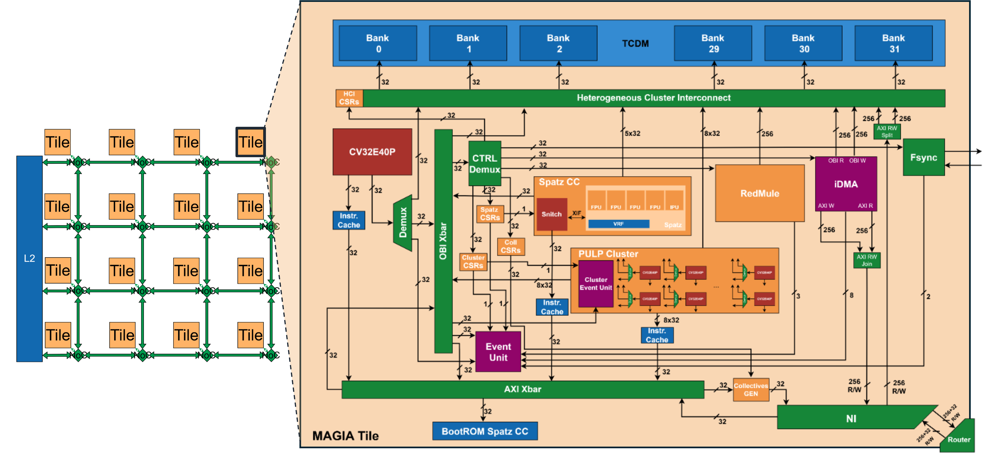

# MAGIA
[](LICENSE.APACHE)
[](LICENSE.SHL)

This repo contains MAGIA (**M**esh **A**rchitecture for **G**enerative **I**ntelligence **A**cceleration), an open-source large-scale accelerator designed for Generative Artificial Intelligence (GenAI). MAGIA is a network of tiles that have at their heart [RedMulE](https://github.com/pulp-platform/redmule) for General Matrix Multiply (GeMM) acceleration, [iDMA](https://github.com/pulp-platform/iDMA) for fast and efficient data movement, [Spatz Core Complex (Spatz CC)](https://github.com/pulp-platform/spatz) for vector workloads acceleration, a [PULP cluster](https://github.com/pulp-platform/cv32e40p) of 8 RISC-V cores for data-parallel workloads, and an L1 scratchpad memory (SPM). Tiles are connected to a mesh Network-on-Chip (NoC) - [FlooNoC](https://github.com/pulp-platform/FlooNoC) - used for communication, and a dedicated network for synchronization - [FractalSync](https://github.com/VictorIsachi/fractal_sync). Each tile is equipped with an [Event Unit](https://github.com/pulp-platform/event_unit_flex) for tile synchronization and event aggregation. MAGIA is designed to support matrices of sizes that vary by orders of magnitude, and also sparse matrix multiplication.

MAGIA is developed as part of the [PULP (Parallel Ultra-Low Power)](https://pulp-platform.org/) project, a joint effort between ETH Zurich and the University of Bologna.

## ⭐ Getting Started

### Pre-requisites

MAGIA uses [bender](https://github.com/pulp-platform/bender) to manage its dependencies and to automatically generate compilation scripts.

We use a virtual python environment which requires python>=3.6.8. To *create the envrionment* use (`MAGIA` folder):

```bash
make python_venv
```

By default, the `python` in your `$PATH` is used. You can specify the version by optionally exporting the `BASE_PYTHON` environment variable.

### Simulation

The following *optional* parameters can be specified:


`mesh_dv`: **0**|**1** (**Default**: 1). 0 simulation of a single tile; 1 simulation of the entire mesh.

`fast_sim`: **0**|**1** (**Default**: 0). 0 simulation that tracks signals (for debugging); 1 faster simulation that does not track signals.

`gui`: **0**|**1** (**Default**: 0). 0 simulation without GUI; 1 simulation with GUI.

`core`: **CV32E40P**|**CV32E40X** (**Default**: CV32E40P). Control core type.

`fsync`: **0**|**1** (**Default**: 1). 1 builds the FractalSync network in the mesh and in every tile (`MAGIA_FSYNC`).


**Instructions to build HW/SW and run simulations**:

**1)** Setup the *environment* (`MAGIA` folder):
```bash
source setup_env.sh
```
**2)** Install *python dependencies* (`MAGIA` folder):
```bash
make python_deps
```
**3)** Download *Bender* (`MAGIA` folder):
```bash
make bender
```
Remember to export the bender binary to your `PATH` variable.
**4)** Clone the *dependencies* and generate the *compilation script* (`MAGIA` folder):
```bash
make vsim-scripts > vsim-scripts.log <mesh_dv> <core>
```
**4\*)** Apply FlooNoC *patch* - **currently FlooNoC requires this step but should not need it in the future** (`MAGIA` folder):
```bash
make floonoc-patch
```
**5)** *Build* the hardware (`MAGIA` folder):
```bash
make build-hw > build-hw.log <mesh_dv> <fast_sim> <core>
```
**6)** *Compile* the test code (`MAGIA` folder):
```bash
make all <test> <mesh_dv> <core>
```
**7)** *Run* test (`MAGIA` folder):
```bash
make run <test> <gui> <mesh_dv> <fast_sim> <core>
```

**Full example**:
```bash
make python_venv
source setup_env.sh
make python_deps
make bender
make vsim-scripts > vsim-scripts.log 
make build-hw > build-hw.log fast_sim=1
make all test=fsync_test
make run test=fsync_test
```

### Simulation with Verilator

MAGIA can also be simulated with [Verilator](https://verilator.org) instead of
QuestaSim. The flow is independent of the `vsim` one above: it has its own
targets, its own build directory (`verilator/build`), and needs no
`build-hw`/`vsim-scripts` step.

Verilator builds the mesh **hierarchically**: the tile is compiled once into a
separate library (`magia_tile_hier`) and instantiated 16 times, instead of
being flattened 16 times over. This is what keeps the build tractable, and it
is why the flow requires `mesh_dv=1` — there is no single-tile Verilator
target at this time.

The following *optional* parameters can be specified:

`core`: **CV32E40P** (**Default**: CV32E40P). CV32E40X is not supported by this
flow.

`VERILATOR_JOBS`: **N** (**Default**: 4). Parallelism used to *build* the model.
Unrelated to simulation speed.

`VERILATOR_THREADS`: **N** (**Default**: 1). Threads the *simulation itself* runs on. See
the note below before changing it.

`VERILATOR_FST`: **&lt;file&gt;** (**Default**: empty). Dump a waveform to this file.

**Instructions to build and run a Verilator simulation**:

**1)** *Build* the model (`MAGIA` folder):
```bash
make verilate core=CV32E40P mesh_dv=1 VERILATOR_JOBS=16
```
**2)** *Compile and run* a test (`MAGIA` folder):
```bash
make verilate-run core=CV32E40P mesh_dv=1 test=inter_l1_test
```
Step **1** is *required at least once*: `verilate-run` compiles the test but
never the model — it runs the `Vmagia_tb` that is already in
`verilator/build/obj_dir`, and errors out if there is none.
**After changing the RTL, re-run `make verilate` yourself**, or you will keep simulating the old model.

**Full example**:
```bash
source setup_env.sh
make verilate core=CV32E40P mesh_dv=1 VERILATOR_JOBS=16
make verilate-run core=CV32E40P mesh_dv=1 test=inter_l1_test
```

Other targets: `verilate-gen` (code generation only), `verilate-build` (native
compile only), `verilate-check-hierarchy` (asserts the model really links the
tile library instead of inlining it), and `clean-verilate`.

#### Waveforms (FST)

The model is **always** built with tracing compiled in, so no rebuild is needed
to capture a waveform. Dumping is off until a run asks for it, and a run that
does not ask pays nothing beyond a larger binary:

```bash
make verilate-run core=CV32E40P mesh_dv=1 test=inter_l1_test VERILATOR_FST=dump.fst
```

The file is written in the test's build directory. Waveforms include the
internals of every tile.

**Let the simulation reach `$finish`.** A run killed before it gets there
leaves the FST unclosed, and an unclosed FST is not a file you can keep: the hierarchy is still sitting in a `<dump>.fst.hier`
companion, so the dump reads only in place and loses every signal name the
moment it is moved.

#### Multithreaded simulation (experimental)

`VERILATOR_THREADS=8` runs the model on 8 threads:

```bash
make verilate core=CV32E40P mesh_dv=1 VERILATOR_JOBS=16 VERILATOR_THREADS=8
make verilate-run core=CV32E40P mesh_dv=1 test=inter_l1_test
```

`VERILATOR_THREADS` is compiled *into* the model, so it belongs on `verilate`
only — passing it to `verilate-run` does nothing, and does not rebuild anything.
To change the thread count, re-run `make verilate` with the new value.

**This is experimental and only partially tested.** What is actually known:

- `VERILATOR_THREADS=8` halved `inter_l1_test` (132 s → 66 s, same result, same
  `$finish` time). Only that one test was checked, once.
- `VERILATOR_THREADS=4` **segfaults at time zero**, deterministically, in an
  `eval_initial` coroutine — from a clean build, same flags but the count.

## ⚙️ Architecture



### Tile
The central piece of the architecture is the MAGIA tile containing a GeMM accelerator, a Vector Processor, a DMA engine, a PULP cluster of RISC-V cores, a multi-banked L1 SPM, an Event Unit, and a lightweight control core. The L1 features interleaved memory banks that compose the Tightly-Coupled Data Memory (TCDM). Each tile has access to the global L2 and to a subset of other tiles' L1, accessing the latter via on-chip remote direct memory access (RDMA). Inter-tile and global communication is carried out through AXI-based narrow (32-bit) and wide (256-bit) NoC channels in [FlooNoC](https://github.com/pulp-platform/FlooNoC). External tiles and the core access the L1 through an OpenBus Interface ([OBI](https://github.com/pulp-platform/obi)) XBAR.

Each tile is controlled by a [CV32E40P](https://github.com/pulp-platform/cv32e40p) or [CV32E40X](https://github.com/openhwgroup/cv32e40x) main core (`core=`). Control of iDMA, RedMulE, FractalSync, Spatz CC, and the PULP cluster follows a memory-mapped model, with the Event Unit handling event aggregation for system control.

`magia_tile` wraps `magia_isle` (cores, accelerators, L1, crossbars and Event Unit) with the FlooNoC network interface and router. What a tile contains is set by its `TileCfg` (`magia_tile_cfg_t` in `hw/mesh/magia_pkg.sv`): which of RedMulE, Spatz CC and the PULP cluster are instantiated and their parameters, the L1 geometry, the control core ISA extensions and the iDMA options. A disabled unit has no hardware, and accesses to its control range raise a simulation assertion.

#### PULP Cluster
Each tile embeds a cluster of `TileCfg.Cluster.NumCores` [CV32E40P](https://github.com/pulp-platform/cv32e40p) cores (8 by default), sharing a Snitch instruction cache with an AXI refill path to L2; each core reaches the tile's L1 through its own HCI port and everything else (accelerator registers, `PULP_CTRL`, remote memory) through its own OBI master port into the tile crossbar. The cluster has its own private [Event Unit](https://github.com/pulp-platform/event_unit_flex) instance, separate from the main core's, providing an intra-cluster dispatch FIFO, a hardware barrier for team rendez-vous, and a hardware mutex — the basis of the `pi_cl_team_fork()`/`pi_cl_team_barrier()` bare-metal, pulp-sdk-API-compatible API (`sw/utils/cluster_utils.h`).

The main core dispatches one task at a time to cluster core 0 only, via a mailbox in the `PULP_CTRL` register block (`0x1740`): binary entry point (`PULP_BINARY`), task function pointer (`PULP_TASKBIN`), argument (`PULP_DATA`), start doorbell (`PULP_START`) and completion flag (`PULP_DONE`). Core 0 — the cluster's sole dispatcher — may then fan work out to the other cores itself, from inside the task, via the cluster's own Event Unit. Every core's Event Unit, main core and cluster cores alike, ORs any cause onto the standard RISC-V MEI (`mip[11]`), so interrupt handling follows the same convention everywhere. On completion (or on a trap), `PULP_CTRL` pulses EU bit 12 on the main core's Event Unit, letting it sleep in `cv.elw` until the cluster is done.

### Mesh
Replicating the MAGIA tile, we scale up to a two-dimensional (2D) mesh of compute tiles. Each tile takes its own `TileCfg` from the `TILE_CFGS` parameter of `magia`: `HOMO_TILE_CFGS` (default) gives every tile all units, `HETERO_TILE_CFGS` splits the tiles into four equal groups of full, RedMulE-only, Spatz-only and cluster-only tiles. The NoC allows access to the global west-side L2 through row-side interfaces, while tiles exchange traffic through FlooNoC router. The mesh uses XY routing and carries both AXI narrow channels (32-bit) and AXI wide channels (256-bit), with protocol conversion handled by per-tile Network Interfaces (NIs).

Rendez-vous among tiles are managed through the FractalSync (FS) mechanism and the dedicated network.

#### Collective Operations
Beyond point-to-point traffic, the routers also implement **collective** operations in hardware: a single transaction can be replicated towards a whole row, column, or the entire mesh (multicast/broadcast), and many transactions can be aggregated on their way to a single destination (reduction, barrier).

Two extra fields on the AXI `user` channel tag a transaction as collective:
```sv
typedef struct packed {
    logic [31:0] collective_mask;  // which tiles take part
    logic [3:0]  collective_op;    // what the routers do with the flits
} axi_user_t;
```
`collective_op` alone decides whether a transaction is collective. `UNICAST` (`0`) means
ordinary point-to-point traffic, and the FlooNoC NI (`chimney`) then **forces the mask to zero**
regardless of what software wrote. So setting a mask without setting an opcode has no effect.
Other available opcodes are: `MULTICAST` (1), `LSBAND` (2, used as a barrier), `FP_ADD`/`FP_MUL`/`FP_MIN`/
`FP_MAX` (3-6), `INT_ADD`/`INT_MUL` (7-8), `INT_MINS`/`INT_MINU`/`INT_MAXS`/`INT_MAXU`
(9-12).

MAGIA configures FlooNoC so that each address region - associated to a tile in the System Address Map (SAM) - is identified by an `x_id` and `y_id` with the corresponding masks:

```sv
// One entry of CollectiveSam (2x2 mesh)
'{
  idx: '{
      id:     '{x: 3, y: 1, port_id: 0},
      mask_x: '{ offset: 20, len: 1, base_id: 2},
      mask_y: '{ offset: 21, len: 1, base_id: 0}
      },
  start_addr: 32'h00300000,
  end_addr:   32'h00400000}
}  // MagiaTileX1Y1
```
`mask_x`/`mask_y` come with the following structure:
| Field | Meaning | Value for a MAGIA mesh |
|---|---|---|
| `offset` | Position of the field in the address / mask word | `x` at 20; `y` directly above it |
| `len`    | Width of the field | 1 for 2x2, 2 for 4x4, 4 for 16x16 |
| `base_id`| Mesh coordinate of tile (0,0) | `base_id` is non-zero for the `x` coordinate because we add an offset to the `x_id` of each MAGIA tile. This offset is required to exclude the memory tiles from the collective operations. More details can be found in  https://doi.org/10.48550/arXiv.2603.26438.|

Routing is ordinary XY with one addition: every bit **set** in
`collective_mask` is a *don't care* on the corresponding destination ID. A
router forwards a flit to every output whose coordinate matches the destination ID on the
bits that are not masked:

Example on a 4x4 mesh - two masked `x` bits and one masked `y` bit give 4 x 2 = 8 destinations:

```text
DEST_ID = (X_ID, Y_ID) = (01, 00)
MASK    = (MASK_X, MASK_Y) = (11, 10)

DEST_ID[0] = (00, 00)    DEST_ID[4] = (10, 00)
DEST_ID[1] = (00, 10)    DEST_ID[5] = (10, 10)
DEST_ID[2] = (01, 00)    DEST_ID[6] = (11, 00)
DEST_ID[3] = (01, 10)    DEST_ID[7] = (11, 10)
```

An all-zero mask is plain unicast; masking the `x` field gives a row multicast, the `y` field a
column, both a broadcast. Reductions use the same mask: the
router derives the set of contributors it must wait for and merges their flits as they
converge on the destination.


### Memory map
This map reflects the RTL memory-mapped layout defined in `hw/tile/magia_tile_pkg.sv`.

- `tile_base = mhartid * 0x0010_0000`

Per-tile local map (offset from `tile_base`, starts at `0x0000_0000`):

| Region            | Local Range             | Global Range (`tile_base + offset`) |
|-------------------|-------------------------|--------------------------------------|
| *RedMulE CTRL*    | `0x0000_0100-0x0000_01FF` | `tile_base + 0x0000_0100 ... 0x0000_01FF` |
| *iDMA CTRL*       | `0x0000_0200-0x0000_05FF` | `tile_base + 0x0000_0200 ... 0x0000_05FF` |
| *FractalSync CTRL*| `0x0000_0600-0x0000_06FF` | `tile_base + 0x0000_0600 ... 0x0000_06FF` |
| *Ctrl-core Event Unit* | `0x0000_0700-0x0000_16FF` | `tile_base + 0x0000_0700 ... 0x0000_16FF` |
| *Spatz CTRL*      | `0x0000_1700-0x0000_173F` | `tile_base + 0x0000_1700 ... 0x0000_173F` |
| *PULP CTRL*       | `0x0000_1740-0x0000_17FF` | `tile_base + 0x0000_1740 ... 0x0000_17FF` |
| *Collective CTRL* | `0x0000_1800-0x0000_18FF` | `tile_base + 0x0000_1800 ... 0x0000_18FF` |
| *Cluster Event Unit (direct)*  | `0x0000_1900-0x0000_28FF` | `tile_base + 0x0000_1900 ... 0x0000_28FF` |
| *Cluster Event Unit (SoC-side)* | `0x0000_2900-0x0000_38FF` | `tile_base + 0x0000_2900 ... 0x0000_38FF` |
| *Reserved*        | `0x0000_3900-0x0000_FFFF` | `tile_base + 0x0000_3900 ... 0x0000_FFFF` |
| *Stack*           | `0x0001_0000-0x0001_FFFF` | Local only: every tile sees its own stack here |
| *L1 SPM*          | `0x0002_0000-0x000F_FFFF` | `tile_base + 0x0002_0000 ... 0x000F_FFFF` |

Shared/global map:

| Region            | Range                   | Notes |
|-------------------|-------------------------|-------|
| *Spatz BootROM*   | `0x1000_0000-0x1000_00FF` | Tile AXI xbar bootrom target |
| *L2*              | `0xB000_0000-0xFFFF_FFFF` | Global L2 window |
| *Instructions*    | `0xCC00_0000-0xCC00_7FFF` | Instruction sub-region inside L2 |

Software/test utility addresses (used by SW runtime and testbench VIP):

| Region            | Address                                    | Notes |
|-------------------|--------------------------------------------|-------|
| *Test End*        | `0xCCFF_0000`                              | Exit code location used by SW runtime/tests |
| *String (utoa)*   | `tile_base + 0x0000_3900`                  | String scratch location (`RESERVED_START + STR_OFFSET`) |
| *Print (stderr)*  | `0xFFFF_0000`                              | Memory-mapped stderr sink in simulation VIP |
| *Print (stdio)*   | `0xFFFF_0004`                              | Memory-mapped stdio sink in simulation VIP |
| *Synch.*          | `tile_base + 0x0000_F100`                  | Derived from `RESERVED_START + SYNC_OFFSET` |

## 🖥️ Programming model
The flow is memory-mapped (MM): software configures and starts accelerators by writing control registers in each tile address space.

- Execution model: SPMD over tiles, with `mhartid` selecting `tile_base = mhartid * 0x0010_0000`.
- Control path: CV32E40P accesses RedMulE, iDMA, FractalSync, Event Unit, and Spatz control registers via MMIO.
- Data path: iDMA moves data between L1 and external memory, while compute engines consume/produce data in L1.
- Synchronization: Event Unit and FractalSync provide interrupt/event and barrier mechanisms for inter-tile coordination.

Software APIs for MM control are under `sw/utils/` (for example `redmule_mm_utils.h`, `idma_mm_utils.h`, `fsync_mm_api.h`, `magia_spatz_utils.h` and `event_unit_utils.h`).
For Spatz Core Complex programming flow (runtime handshake, task loading, and execution model), see [spatz/README.md](spatz/README.md).


### Collective Operations
MAGIA supports collectives on both the narrow and the wide FlooNoC channel, through two
independent programming paths.

#### Wide channel
The wide channel is used exclusively by the iDMA. Only multicast and broadcast are
supported here; the typical use is pushing one tile's L1 buffer into every other tile's L1.
Mask and opcode live in the iDMA's own registers, not in the tile CSRs, and are set for you
by `collective(..)` in [idma_mm_utils.h](sw/utils/idma_mm_utils.h):

```c
printf("Multicast over the row...\n");
uint32_t transfer_id_1 = collective(dst_addr, broad_addr, len, gen_collective_mask(ROW), MULTICAST);
dma_wait(transfer_id_1);   // poll for completion
```

#### Narrow channel
The narrow channel can be used to issue barrier, reduce and multicast transactions. Before issuing a collective over the narrow channel two tile CRSs must be properly configured:

| Register | Address | Meaning |
|---|---|---|
| `COLLECTIVE_MASK` | `tile_base + 0x0000_1800` | *Which* tiles take part |
| `COLLECTIVE_OP`   | `tile_base + 0x0000_1804` | *What* the routers do with the flits |

A store is then tagged collective if it is written at `COLLECTIVE_ADDR_OFFSET` (`0xB000_0000`). The APIs required to configure and use collective transactions over the narrow channel can be found in [magia_coll_utils.h](sw/utils/magia_coll_utils.h).

**Programming flow**
1. `set_collective_mask()` to set the `COLLECTIVE_MASK` register
2. `set_collective_op()` to set the `COLLECTIVE_OP` register
3. A store at address `0xB000_0000` is then interpreted as a collective transaction

### PULP Cluster programming flow
The PULP cluster uses a bare-metal, two-level dispatch model. The cluster binary is compiled as a position-independent ELF (origin `0x0`, `-fPIC`, `-mno-relax`), converted to a flat binary and embedded in the CV32 ELF as a byte array in the `.pulp_binary` section (see `sw/kernel_pulp/`).

**Level 0 — CV32 → cluster core 0** (`sw/utils/cluster_utils.h`, `sw/utils/magia_pulp_utils.h`, `sw/kernel_pulp/pulp_crt0.S`):

1. `cluster_boot(binary_start)` — writes `PULP_BINARY`, asserts `CLK_EN`, polls `PULP_READY` until all 8 cores have armed (every core, not just core 0, posts to this counter).
2. `cluster_arm_done_event()` — clears the CV32 Event Unit buffer and enables only EU bit 12 (cluster-done), avoiding spurious wakeups from stale RedMulE/iDMA/etc. events.
3. `cluster_dispatch_task(task_addr)` — writes `PULP_TASKBIN`/`PULP_DATA`, rings `PULP_START` as a doorbell; core 0 (the cluster's sole dispatcher) is the only core that ever reads this mailbox. Returns once core 0 has ACK'd (`PULP_START` self-clears).
4. `cluster_wait_done_eu()` — CV32 sleeps in `cv.elw` until EU bit 12 fires.
5. `cluster_stop()` — de-asserts `CLK_EN` to gate the cluster clock.

**Level 1 — core 0 → the rest of the team** (`sw/utils/cluster_utils.h`, cluster's own Event Unit): core 0 may fan work out to cores 1-7 with `pi_cl_team_fork(n, entry, arg)` — a bare-metal, pulp-sdk-API-compatible reimplementation: it configures the team on the cluster's dispatch FIFO, pushes `{entry, arg}`, runs `entry(arg)` itself, then rendez-vous with the rest of the team on a hardware barrier. Workers otherwise park in `worker_wait` (`pulp_crt0.S`), asleep on the dispatch FIFO. `pi_cl_team_critical_enter()/exit()` (hardware mutex) and `pi_cl_team_push_other()`/`pi_cl_team_barrier_id()` (disjoint concurrent sub-teams) are also available — see `sw/tests/cluster_tests/parallel_groups/` for a worked example of two teams running concurrently on disjoint core subsets.

Cluster task sources live under `sw/tests/<test>/pulp_task/`. A test directory containing a `pulp_task/` subdirectory automatically triggers the dual-binary build flow in the Makefile.
## 🧰 Changing number of tiles
**Supported Mesh Configurations**: `2x2`, `4x4`, `8x8`, `16x16`, `32x32`

**Scripts**: The `num_cores` parameter in the `Makefile` specifies for how many core stack traces should be generated.

**Tests**  : The `MESH_X_TILES` and `MESH_Y_TILES` parameters in `sw/utils/magia_utils.h` adapt the software stack to the specific mesh configuration.

**RTL/TB** : The `N_TILES_X` and `N_TILES_Y` parameters in `hw/mesh/magia_pkg.sv` specifie the number of tiles and allows the derivation of the appropriate data and syncrhonization networks.

## 🧪Local testing
The [`run_regression.py`](scripts/run_regression.py) Python script runs the tests listed in [`tests.yml`](sw/tests/tests.yml), which gives for each test its testbench (`mesh` or `tile`), the control cores it runs on (`cores`) and the defines it needs (`requires`). The configurations to run are always given explicitly, run one after the other, and each one is built in its own git worktree under `.regression/`; the HW is rebuilt only when its sources change.

The script is invoked from the main directory of this repository. The RISC-V GCC and `bender` must be on `PATH` (or set `BENDER`), `SPATZ_LLVM_PATH` points to the Spatz LLVM, and `MAGIA_QUESTA_SETUP` / `MAGIA_VERILATOR_SETUP` can hold the commands that load the simulators (e.g. `module load ...`):
```sh
scripts/run_regression.py --sim questa --core CV32E40P --fsync on --test general/hello_mesh   # one test
scripts/run_regression.py --sim verilator --core CV32E40P --fsync on --test collective_tests  # one folder
scripts/run_regression.py --sim questa --core all --fsync on --test tile                      # every tile test
scripts/run_regression.py --sim all --core all --fsync all --test all                         # everything
scripts/run_regression.py --sim all --core all --fsync all --test all --list                  # plan only
```

`--test` takes `all`, a testbench (`mesh`, `tile`), a folder of `sw/tests/` (`general` is `sw/tests/` itself) or one test as `folder/test`. The run shows a dashboard of every build; the results, `summary.md` and one log per HW build and per test end up in `.regression/results/<date_time>/`. See the header of the script for every option.

## 🔏 License
MAGIA is an open-source project with a permissive license. All `software` sources are licensed under the Apache License 2.0 ([`LICENSE.APACHE`](LICENSE.APACHE)). All `hardware` sources are licensed under the Solderpad Hardware License 0.51 ([`LICENSE.SHL`](LICENSE.SHL)).

